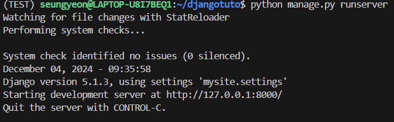

### Django 예제 application 테스트

##### 연습 목표
1. URL, Template, View의 개념 이해하기 (MVT 모듈)
2. Python 가상머신 테스트
3. runserver 테스트는 추후 별도의 서버 사용에 앞서 naive 테스트를 진행하기 위함입니다.
---
#### 테스트 방법
###### **반드시 작성된 순서를 따라주세요 !!!**
##### - linux 환경 구성 (Window 사용자만 해당됩니다. 자세한 내용은 WSL 환경 구성 자료들을 참고해 주세요. 권장 WSL은 Ubuntu LTS이고 버전은 상관 없습니다.) 

###### **☆ 하단의 모든 과정은 linux 터미널(MacOS는 설치된 terminal을, Window는 WSL 설치를 완료한 후 cmd 창에서 명령어 wsl을 입력)에서 진행됩니다.**
##### - 파이썬 가상머신 설치 (명령어: python -m venv {가상환경명})
###### 만약 설치가 안 된다면 python 대신 python3로 바꿔서 재입력 해주세요. pip가 설치되지 않아서 생기는 오류는 sudo apt install python3-pip를 입력해서 pip를 먼저 설치한 후에 시도해 주세요.  *여기서 python으로 명령어가 실행되었다면 앞으로도 python만 사용하면 되고, python3로 해야만 설치가 된다면 앞으로도 명령어를 항상 pyhton3로 입력해 주세요.*
##### - 파이썬 가상머신 접속 (명령어: source {가상환경명}/bin/activate) 
###### 가상머신 접속에 성공했다면 맨 왼쪽에 ({가상환경명})이라는 헤드가 추가될 것입니다.  가상머신 종료는 deactivate 명령어만 입력해 주면 실행할 수 있습니다.  linux 터미널을 닫기 전에 반드시 가상머신이 종료된 상태인지 확인할 것을 권장드립니다.
##### - "가상머신 접속 상태"에서 django 설치 (명령어: pip install django) 
###### 여기까지 완료되었다면 django 실행 환경은 모두 자동적으로 python이 구성해 주었을 것입니다. 
##### - Backend 레포지토리의 위치를 Https로 복사하여 git clone {복사한 url} 명령어로 레포지토리의 내용을 모두 가져와주세요.
###### 복사한 데이터(cd Backend로 확인) 중에 djangotuto 디렉토리가 존재해야 합니다.
##### - 명령어: cd djangotuto로 디렉토리 이동 후 명령어: python manage.py runserver 입력 
###### *오류가 발생하면 ls를 입력해서 해당 위치에 manage.py가 존재하는지 확인하시길 바랍니다.*    위와 같이 메세지가 출력되면 서버가 성공적으로 열린 것입니다.
##### - chrome 창을 열어서 http 칸에 http://localhost:8000/polls/ 를 입력하고 엔터를 눌러주세요. 
###### (주의) https가 아닌 http로 접속해야 합니다.  화면에 "투표 앱에 입장하셨습니다" 텍스트와 투표 항목 2가지가 뜨면 테스트 성공입니다. :)
